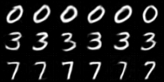
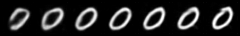
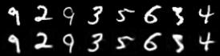

# CVQ — Channel-wise Vector Quantization (unofficial)

[](https://github.com/tachytelicdetonation/CVQ/actions/workflows/ci.yml)
[](https://arxiv.org/abs/2605.26089)
[](LICENSE)

Unofficial PyTorch implementation of **"Channel-wise Vector Quantization"**
([arXiv:2605.26089](https://arxiv.org/abs/2605.26089)) — Song et al., 2026 —
covering both:

- **CVQ**: a tokenizer that quantizes the *channels* of a feature map
  (each codeword is an `h×w` spatial map) instead of spatial patches,
  reaching ~100% codebook utilization with no auxiliary tricks, and
- **CAR**: text-to-image generation by **next-channel prediction** — a
  decoder-only LLM autoregresses over the 1D channel sequence,
  sketching global structure first and refining detail channel by channel.

The same pipeline runs at two scales:

| Tier | Config | Hardware | Purpose |
|---|---|---|---|
| **MNIST** | `configs/*_mnist.yaml` | macOS (MPS) / CPU / any GPU | verify the full pipeline end-to-end in minutes |
| **Paper** | `configs/tokenizer_imagenet_*.yaml`, `configs/car_t2i_qwen3_4b.yaml` | multi-GPU | reproduce the paper's setup (ImageNet-1K tokenizer, Qwen3 backbone) |

The MNIST tier is a 1/4-scale homothety of the paper's setup, preserving the
dimensionality-parity property `c = h·w` (Sec. 4): 32×32 images, `f=4` →
8×8 latent, **64 channel tokens** of dim 64, codebook 1,024 — vs. the paper's
256×256, `f=16` → 16×16, **256 channel tokens** of dim 256, codebook 16,384.

## Results (MNIST tier, trained in ~8 minutes on an M-series MacBook)

Text-conditioned samples from CAR ("a handwritten digit 0 / 3 / 7", six each)
and the paper's Fig. 5 coarse-to-fine sweep — one sample decoded from its
first 1, 2, 4, 8, 16, 32, 64 channels:

<p align="center">
  
  <br>
  
</p>

CVQ tokenizer reconstructions after 700 training steps (top: original,
bottom: reconstruction):

<p align="center">
  
</p>

## Install

```bash
uv venv && uv pip install -e .            # core (enough for the MNIST tier)
uv pip install -e ".[perceptual]"         # + LPIPS (paper tokenizer recipe)
uv pip install -e ".[llm]"                # + transformers (Qwen3 CAR backbone)
uv pip install -e ".[eval]"               # + torchmetrics (rFID)
```

## Quickstart (MNIST, runs on a laptop)

```bash
# 1. Train the CVQ tokenizer (downloads MNIST automatically)
python -m cvq.train_tokenizer --config configs/tokenizer_mnist.yaml

# 2. Train CAR on the frozen tokenizer (prompts: "a handwritten digit N")
python -m cvq.train_car --config configs/car_mnist.yaml

# 3. Sample, with the paper's coarse-to-fine progressive decode (Fig. 5)
python -m cvq.sample --config configs/car_mnist.yaml \
    --prompts "a handwritten digit 3" "a handwritten digit 7" --progressive

# 4. Tokenizer metrics: PSNR / SSIM / codebook usage / rFID (Table 1)
python -m cvq.eval_reconstruction --config configs/tokenizer_mnist.yaml
```

## Tests

```bash
pytest tests/ -q                                  # fast shape/gradient checks (<1s)
pytest tests/test_ablation_dropout.py -m slow -s  # nested-dropout ablation (~3 min)
```

The slow test reproduces the *mechanism* behind the paper's Table 7/8
ablation at MNIST scale: it trains two small tokenizers (nested dropout
α=0.25 vs α=0) and asserts that (1) full-channel reconstruction is
comparable, (2) decoding from only the first c/8 or c/4 channels is
clearly better with dropout (the coarse-to-fine ordering CAR depends on),
and (3) reconstruction improves monotonically as channels are added.
Measured on MPS: truncated-MSE ratio ≈ 0.6 at c/8–c/4, ≈ 1.0 at full
channels — dropout orders information at no fidelity cost.

## Reproducing the paper

**Tokenizer** (Sec. 4.1): point `configs/tokenizer_imagenet_256tok.yaml` at
ImageNet-1K and train — the config encodes the paper's recipe: 256×256,
codebook 16,384, 100 epochs, Adam(β₁=0.5, β₂=0.9), lr 1e-4, wd 1e-4, global
batch 256, L2 + commitment + LPIPS + PatchGAN. `tokenizer_imagenet_1024tok.yaml`
is the f=8 / 1024-token variant (Table 1, bottom).

**CAR** (Sec. 4.2, Appendix E): `configs/car_t2i_qwen3_4b.yaml` with your
text–image corpus as a jsonl (`{"image": ..., "text": ...}` per line; the paper
uses an 80M-pair mixture). Two stages:

```bash
# Stage I: projector + LM head only, LLM frozen (lr 1e-4)
python -m cvq.train_car --config configs/car_t2i_qwen3_4b.yaml
# Stage II: end-to-end (set train.stage: 2, lr 2.0e-5 in the config)
python -m cvq.train_car --config configs/car_t2i_qwen3_4b.yaml --resume runs/car_t2i_4b/car.pt
```

Note: single-process only; wrap with DDP/FSDP (e.g. `accelerate`) to reach the
paper's global batch sizes.

## Paper → code map

| Paper | Code |
|---|---|
| Eq. 3–5: channel-wise lookup + STE | `cvq/models/quantizer.py` |
| Sec. 3.1 tokenizer training (L2 + commit + LPIPS + PatchGAN) | `cvq/losses.py`, `cvq/train_tokenizer.py` |
| Eq. 6: next-channel prediction | `cvq/models/car.py::CARModel.forward` |
| Sec. 3.2 two-layer MLP projector into the LLM | `CARModel.projector` |
| Appendix B.1: nested channel dropout, `c_keep ~ U(1, c)` w.p. α | `CVQTokenizer.sample_c_keep`, masking in `ChannelVectorQuantizer.forward` |
| Eq. 8: adaptive GAN weight `λ₀/(1+e^{−η(c_keep−c/2)})` | `cvq/losses.py::adaptive_gan_weight` |
| Sec. 4.2: Stage I/II recipe (AdamW 0.9/0.96, wd 1e-3) | `cvq/train_car.py` |
| Fig. 5 / Table 8: progressive channel decoding | `CVQTokenizer.decode_indices(c_keep=...)`, `cvq/sample.py --progressive` |

## Deviations & unknowns (the paper underspecifies these)

- **Sampling hyperparameters** (temperature / top-k / CFG scale) are not given
  in the paper; defaults here are temperature 1.0, CFG 2.0 — tune via
  `cvq.sample` flags.
- **CFG training** (text-prefix dropout, p=0.1) is standard practice but not
  explicitly described in the paper.
- The paper's variable-resolution extension (Appendix D, learnable resampling
  queries around the lookup) is **not implemented**; fixed-resolution only.
- VQGAN details the paper inherits silently (disc start step, hinge loss,
  attention placement) follow taming-transformers conventions.
- Distributed training, EMA, and lr schedules are left to the user; the paper
  does not describe them.

## Citation

This is an independent, unofficial implementation; all credit for the method
goes to the authors. If you use this code, please cite the paper:

```bibtex
@article{song2026cvq,
  title   = {Channel-wise Vector Quantization},
  author  = {Song, Wei and Wang, Tianhang and Chen, Yitong and Zhang, Tong
             and Wu, Zuxuan and Li, Min and Wang, Jiaqi and Yu, Kaicheng},
  journal = {arXiv preprint arXiv:2605.26089},
  year    = {2026}
}
```

Repository metadata for citing this implementation is in
[`CITATION.cff`](CITATION.cff). Licensed under [MIT](LICENSE).

## Acknowledgments

- Architecture conventions for the encoder/decoder and the VQGAN training
  recipe follow [taming-transformers](https://github.com/CompVis/taming-transformers)
  (Esser et al., 2021).
- Nested dropout follows Rippel et al., 2014.

## Repo layout

```
cvq/
  models/
    autoencoder.py   # VQGAN-style CNN encoder/decoder
    quantizer.py     # ChannelVectorQuantizer (the core idea)
    tokenizer.py     # CVQTokenizer + nested channel dropout
    discriminator.py # PatchGAN
    backbones.py     # TinyGPT (laptop) | HF Qwen3 (paper)
    car.py           # CARModel: next-channel prediction + CFG sampling
  losses.py          # VQGAN loss + adaptive GAN weight (Eq. 8)
  data.py            # mnist | imagefolder | jsonl text-image
  text.py            # word-level (MNIST) | HF (Qwen3) text tokenizers
  train_tokenizer.py, train_car.py, sample.py, eval_reconstruction.py
configs/             # mnist tier + paper-scale configs
```
